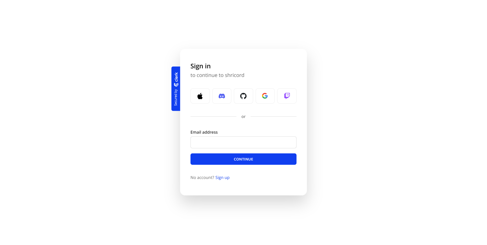
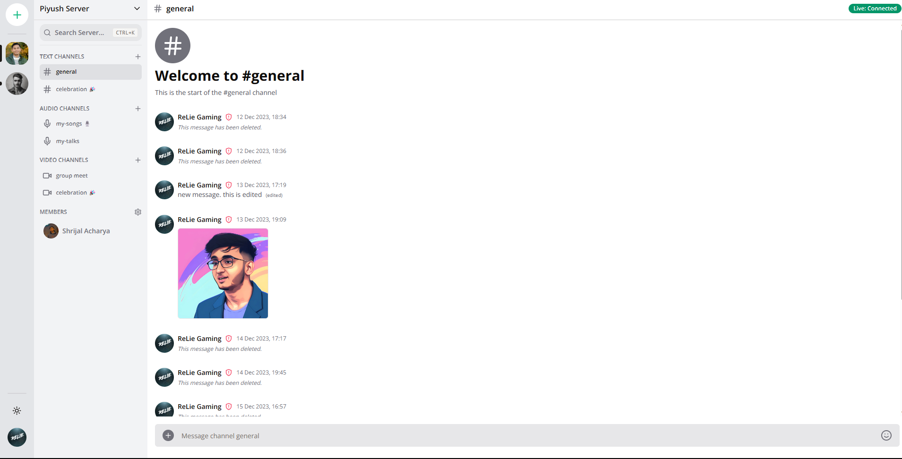
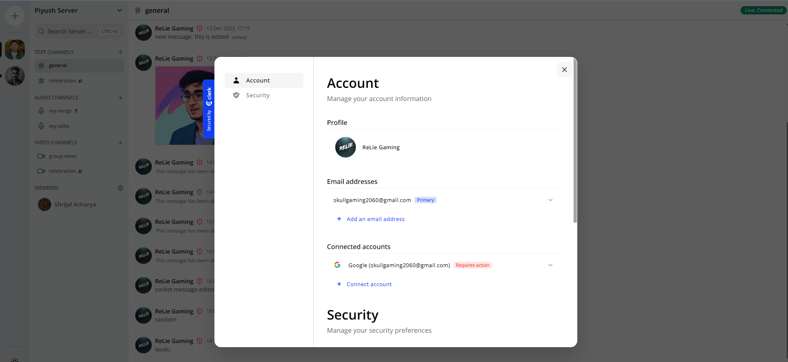
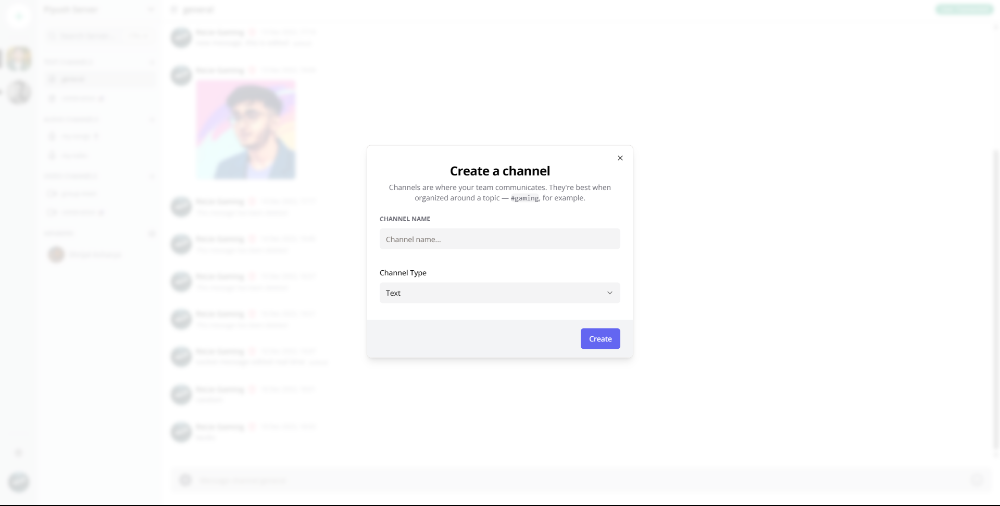
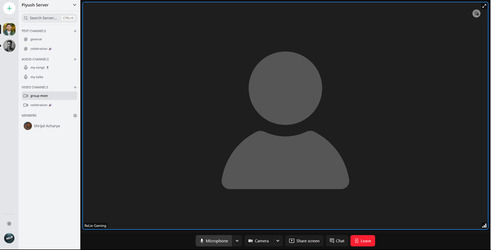

<br/>
<p align="center">
  <a href="https://github.com/shricodev/shricord-chat">
    
  </a>

  <h3 align="center">Minimalistic Discord Chat App</h3>

  <p align="center">
    Minimalistic Discord with just the necessary features 😻😎
    <br/>
    <br/>
    <a href="https://github.com/shricodev/shricord-chat">View Demo</a>
    .
    <a href="https://github.com/shricodev/shricord-chat/issues">Report Bug</a>
    .
    <a href="https://github.com/shricodev/shricord-chat/issues">Request Feature</a>
  </p>
</p>


## Table Of Contents

- [About the Project](#about-the-project)
- [Built With](#built-with)
- [Getting Started](#getting-started)
  - [Prerequisites](#prerequisites)
  - [Installation](#installation)
- [Contributing](#contributing)
- [License](#license)
- [Authors](#authors)
- [Show your support](#show-your-support)

## About The Project

The `shricord-chat` project is a minimalistic Discord platform built using Next.js, offering just the necessary features for a seamless user experience.











## Built With

- [Typescript](https://www.typescriptlang.org/)
- [NextJS](https://nextjs.org)
- [Uploadthing](https://uploadthing.com)
- [TailwindCSS](https://tailwindcss.com/)
- [Zod](https://zod.dev/)
- [Zustand](https://github.com/pmndrs/zustand)
- [Socket.io](https://socket.io/)
- [Prisma](https://www.prisma.io/)
- [React Query](https://tanstack.com/query/latest)
- [React Hook Form](https://react-hook-form.com/)
- [Livekit](https://livekit.io/)

## Getting Started

This is an example of how you may give instructions on setting up your project locally.
To get a local copy up and running follow these simple example steps.

### Prerequisites

First of all, you need to have `pnpm`` installed on your machine. You can install it using the following command.

```sh
npm install pnpm@latest -g
```

### Installation

> 🔴 **If you wish to setup the project locally, follow the installation instructions.**

1. Get all the necessary API keys shown in the `.env.example` file.

2. Clone the repo

```sh
git clone https://github.com/shricodev/shricord-chat.git
```

3. Install PNPM packages

```sh
pnpm install
```

4. Run the application locally

```sh
pnpm run dev
```

5. **(Optional)** View the database schema

```sh
pnpx prisma studio
```

## Contributing

See the [open issues](https://github.com/shricodev/shricord-chat/issues) for a list of proposed features (and known issues).

Contributions are what make the open source community such an amazing place to be learn, inspire, and create. Any contributions you make are **greatly appreciated**.

- If you have any suggestions, feel free to [open an issue](https://github.com/shricodev/shricord-chat/issues/new) to discuss it, or directly create a pull request.
- Please make sure you check your spelling and grammar.
- Create individual PR for each suggestion.

### Creating A Pull Request

1. Fork the Project
2. Create your Feature Branch (`git checkout -b feature/AmazingFeature`)
3. Commit your Changes (`git commit -m 'Add some AmazingFeature'`)
4. Push to the Branch (`git push origin feature/AmazingFeature`)
5. Open a Pull Request

## License

Distributed under the Apache 2.0 License. See [License](https://github.com/shricodev/shricord-chat/blob/main/LICENSE) for more information.

## Authors

- **Shrijal Acharya** - _Full Stack SDE_ - [Shrijal Acharya](https://shricodev.tech) - _Founder_

* Website: https://shricodev.tech
* Twitter: [@shricodevv](https://twitter.com/shricodevv)
* Github: [@shricodev](https://github.com/shricodev)
* LinkedIn: [@shrijal007](https://linkedin.com/in/iamshrijal)
* Instagram: [@iampiyush.ach](https://www.instagram.com/iampiyush.ach/)

## Show your support

Give a ⭐️ if this project helped you!
